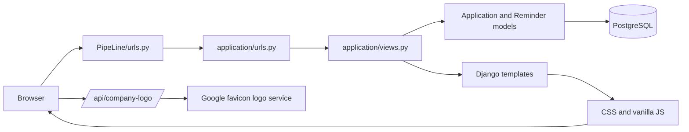

# Architecture

## Overview

Pipeline is a server-rendered Django web application for tracking job applications. The project has one Django app, `application`, and uses Django templates for the UI with app-local CSS and vanilla JavaScript for presentation behavior. It also has one small JSON endpoint for company-logo lookup; there is no separate frontend application.

## Main components

- `PipeLine/manage.py` is the Django command-line entry point and selects `PipeLine.settings`.
- `PipeLine/PipeLine/settings.py` configures Django, middleware, installed apps, templates, static files, PostgreSQL, and environment loading.
- `PipeLine/PipeLine/urls.py` exposes the admin site at `/admin/` and delegates the root URL space to the application app.
- `PipeLine/PipeLine/asgi.py` and `PipeLine/PipeLine/wsgi.py` expose the standard Django ASGI and WSGI callables. No deployment configuration is included in the repository.
- `PipeLine/application/` contains the product code: models, form, views, routes, admin registration, tests, templates, and static assets.

## Module responsibilities

| Module | Responsibility |
| --- | --- |
| `application/models.py` | Defines `Application` and `Reminder`, their fields, ordering, display values, and application-derived initials/logo defaults. |
| `application/forms.py` | Defines the `ApplicationForm` ModelForm used for create and update requests. |
| `application/views.py` | Builds shared dashboard/application context, renders pages, handles application writes, and provides the company-logo lookup endpoint. |
| `application/urls.py` | Maps the dashboard, applications page, modal form endpoint, and company-logo JSON endpoint. |
| `application/admin.py` | Registers both models with the Django admin. |
| `application/templates/` | Contains the shared layout, dashboard, application list, and modal markup. |
| `application/static/css/style.css` | Provides the visual design and responsive layout. |
| `application/static/js/app.js` | Provides modal, debounced logo lookup, upload preview, search, status filtering, detail/edit interactions, toast messages, and client-only reminder completion styling. |
| `application/migrations/0001_initial.py` | Creates the initial `Application` and `Reminder` tables. |
| `application/migrations/0002_application_logo_image_application_logo_url.py` | Adds automatic logo URL and optional uploaded logo fields to applications. |
| `application/tests.py` | Contains Django view and persistence tests for the current application workflows. |

## Request flow

1. A browser request enters through Django's root URL configuration.
2. The root configuration delegates application URLs to `application.urls`.
3. `dashboard` and `applications` call `shared_context()`, which queries applications and reminders and calculates status counts and JSON data for the templates.
4. Django renders the requested template using the shared `base.html` layout.
5. The browser loads the app-local CSS and JavaScript through Django's static-file handling.
6. The debounced company-name lookup calls `/api/company-logo/`, which queries Clearbit autocomplete server-side and returns a logo URL or an empty result.
7. Create, update, and delete actions are POSTed to `applications_modal` as multipart form data. The view validates `ApplicationForm`, saves or deletes the model, adds a Django message, and redirects.

## Data flow and database

The primary entities are:

- `Application`: company, role, status, applied date, optional logo style, validated automatic `logo_url`, optional locally stored `logo_image`, derived initials, and creation/update timestamps. Status choices are Applied, Phone Screen, Interview, Offer, and Rejected.
- `Reminder`: a task linked to an application by a cascading foreign key, with due date, urgency, completion flag, and creation timestamp.

The configured database engine is PostgreSQL. Connection values are read from `DB_NAME`, `DB_USER`, `DB_PASSWORD`, `DB_HOST`, and `DB_PORT`. Django migrations are the schema source for the repository. Uploaded logos use Django's local media storage under `MEDIA_ROOT`; automatic logos are stored as validated HTTPS URLs. The application does not define a broad API or repository/service layer.

On page requests, model querysets are transformed into template context. `applications_json` is embedded in the modal component with Django's `json_script` and consumed by the browser JavaScript for view and edit dialogs. Form submissions return to an HTML page rather than returning JSON.

## Backend and frontend relationship

The backend owns routing, validation, persistence, status counts, and server-rendered data. The frontend is embedded in Django templates and owns interaction details such as opening modals, filtering already-rendered application rows, showing toasts, and visually marking reminders complete. Client-side reminder completion is not persisted because there is no reminder update endpoint.

The base template references Google Fonts (`DM Sans` and `Fraunces`) from `fonts.googleapis.com`. The backend uses Clearbit's public autocomplete endpoint for domain discovery, then Google’s favicon endpoint to retrieve the logo image; no API key is exposed or required by this implementation.

## Important design decisions

- A single Django app is sufficient for the current scope and keeps the model, views, templates, and static assets together.
- Shared page context is centralized in `shared_context()` so the dashboard and applications page receive the same application data.
- The application form endpoint supports create and update through an optional `application_id`, and delete through the `action=delete` POST value.
- Django's built-in admin, messages, CSRF protection, sessions, and authentication middleware are enabled, although the product views do not currently implement a login workflow.

## Current limitations

- The configured secret key has a development fallback, `DEBUG` is always enabled, and `ALLOWED_HOSTS` is empty; these settings are not production-ready.
- There is no user model integration, access control, or multi-user data ownership in the application workflow.
- Reminders can be displayed and visually toggled in the browser, but completion is not saved to the database.
- The dashboard contains hard-coded greeting, follow-up, and analytics copy; the response-rate chart is not calculated from database data.
- The Calendar, notifications, and full analytics controls currently show client-side toast messages rather than calling backend features.
- There is no application status history model or endpoint.
- Automatic logo lookup depends on external domain-discovery and image services and can return no logo or fail without affecting application saves.
- Uploaded logo files are stored locally and are served through Django's debug media route; production media serving is not configured.
- No deployment manifests, container configuration, static collection configuration, or production server configuration are included.

## Scalability considerations

If the application grows, the first useful steps would be adding database indexes and targeted aggregate queries for larger application sets, persisting reminder actions through dedicated POST endpoints, and introducing users plus ownership constraints before exposing the system to multiple people. Larger product areas could then be split into Django apps, while the current template-based frontend can remain in place until an API or separate client is justified.